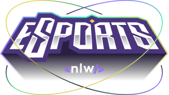

<h1 align="center">
  
</h1>

  

 

  

## ✨ Tecnologias

Esse projeto foi desenvolvido com as seguintes tecnologias:

- [Node.js](https://nodejs.org/en/)
- [Typescript](https://www.typescriptlang.org/)

## 💻 Projeto

O projeto tem como finalidade, ser um cadastro de buscas de jogadores online, disponibilizando o contato pelo Discord e tendo a visão dos melhores dias e horários com disponibilidade para iniciar partidas.

## 🚀 Como executar

- Clone o repositório e acesse o diretório

### Para rodar localmente

- Rode `npm install` para instalar as dependências;
- Rode, em outro terminal, o `npm run dev` para iniciar a aplicação em ambiente local;

## 📄 Licença

Esse projeto está sob a licença MIT. Veja o arquivo [LICENSE](LICENSE.md) para mais detalhes.

---
